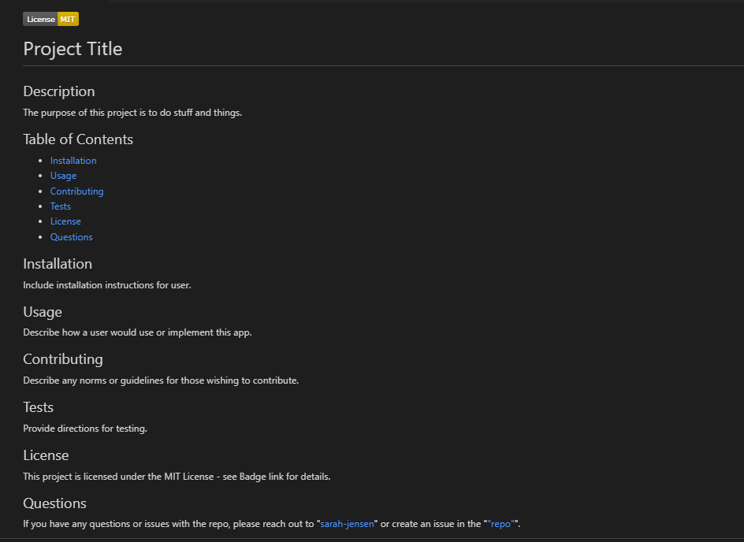
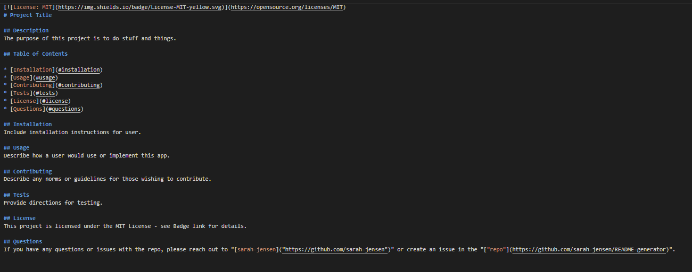

  
  # Command Line README Generator
  
  ## Description
  The purpose of this project was to develop a Node.js application that takes user input from the command line using the Inquirer package and generates a README file. The ability to quickly and easily generate a README file using a command-line application allows project creators to devote more time to developing their project. This project was a component of the Berkeley Fullstack Flex Web Development coding bootcamp.
  
  ## Table of Contents
  
  * [Preview](#preview)
  * [Installation](#installation)
  * [Usage](#usage)
  * [License](#license)
  * [Credits](#credits)
  * [Questions](#questions)
  
  ## Preview
  

  ---
  - After completing the installation steps, the user can access the Command Line README Generator by navigating through the command line to the `develop` directory where all the necessary `node` modules, the `inquirer` package, and the `index.js` file are located. They can then call the application by typing `node index` in the command line.
  Raw README file
  
  
  ## Installation
  1. [Clone](https://github.com/sarah-jensen/README-generator) or [download](https://github.com/sarah-jensen/README-generator/archive/refs/heads/master.zip) the repository to your computer. 
  2. Install the necessary packages: [node.js v18.12.1](https://nodejs.org/en)
  3. Open the `Develop` directory in your terminal (or Integrated Terminal if using VS Code) 
  4. Type `npm init -y` in the command line to install `node_modules`
  5. Type `npm i inquirer@8.2.4` to install the `inquirer` package. 
  6. Run the application by typing `node index` in the command line.

  ## Usage
  After following Installation instructions and running the application, the README file will be automatically added to the `Develop` directory. You may copy and paste the file to the repo for your project. Be aware that each time the application is run, the previously generated `README.md` will be overwritten.
  
  ## License
  This project is open source and available under the [MIT License](./LICENSE)

  ## Credits
  Starter code cloned from [coding-bootcamp-repository](https://github.com/coding-boot-camp/potential-enigma).
  License badges created by [shields.io](https://shields.io/) and collected by [lukas-h](https://gist.github.com/lukas-h/2a5d00690736b4c3a7ba).
  Support and debugging provided by my classmate, [Olena P](https://github.com/UserOlena).
  
  ## Questions
  If you have any questions or issues with the repo, please reach out to "[sarah-jensen]("https://github.com/sarah-jensen")" or create an issue in the "["repo"](https://github.com/sarah-jensen/README-generator)".
